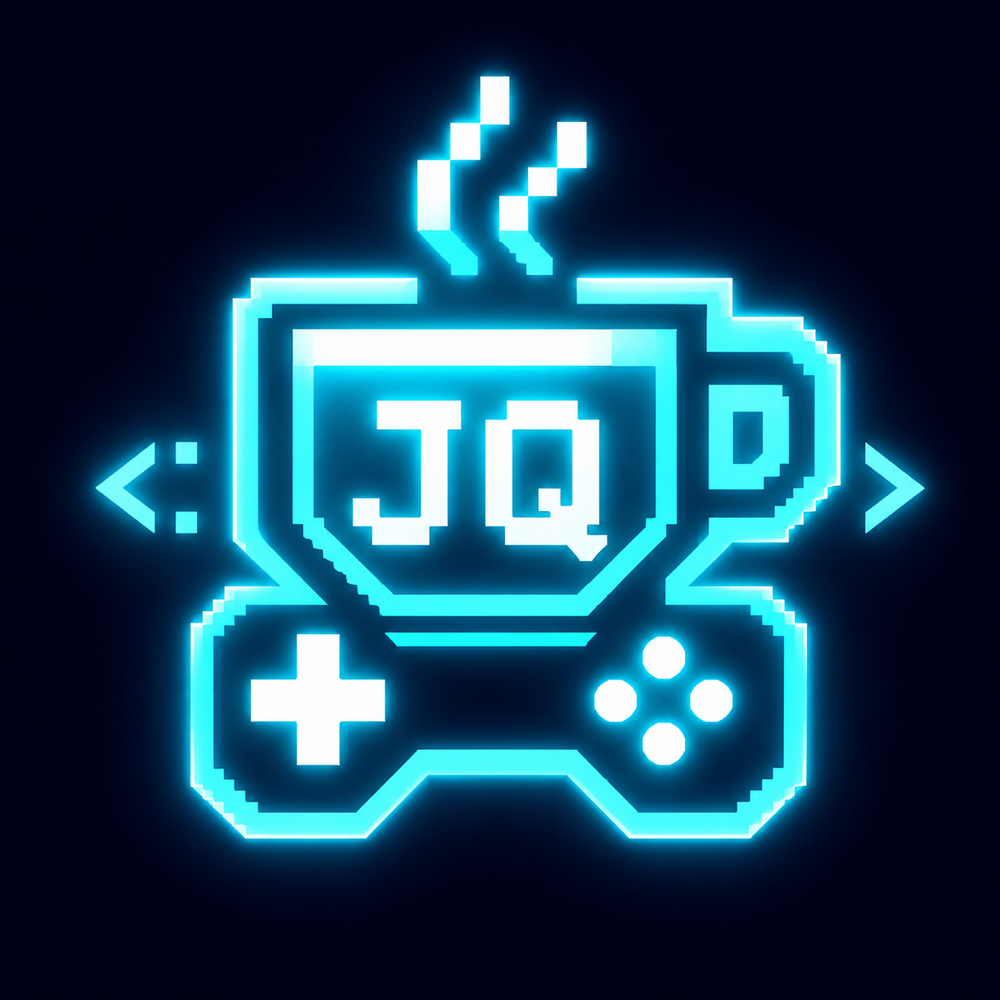
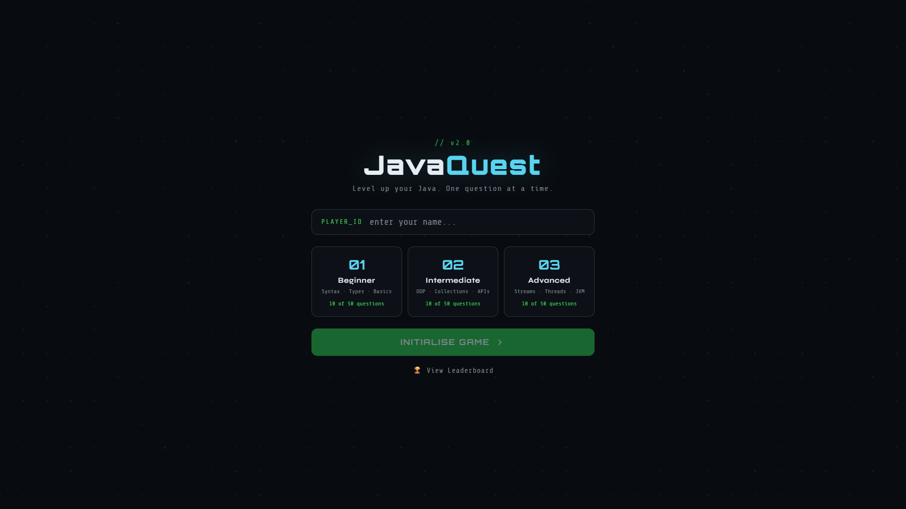
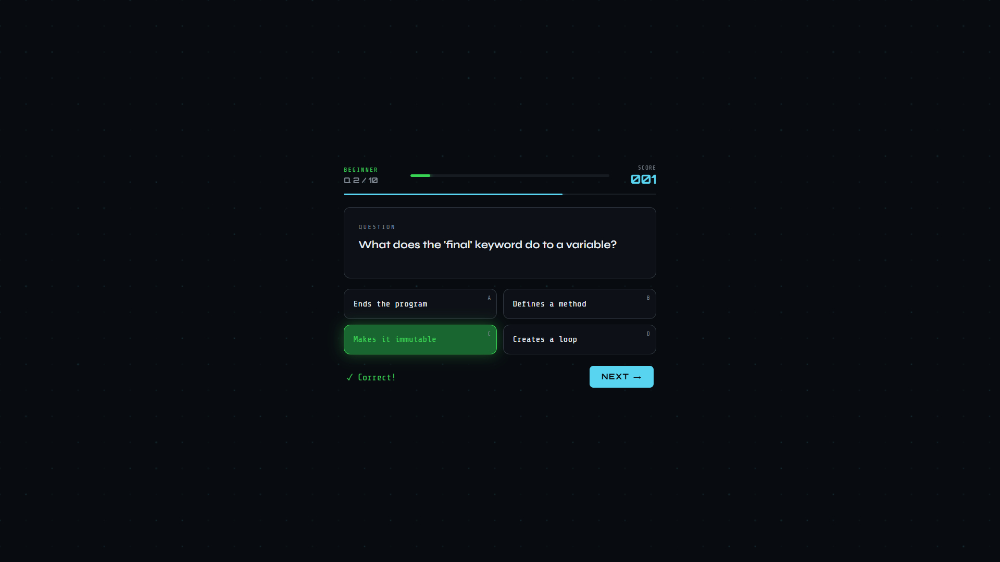
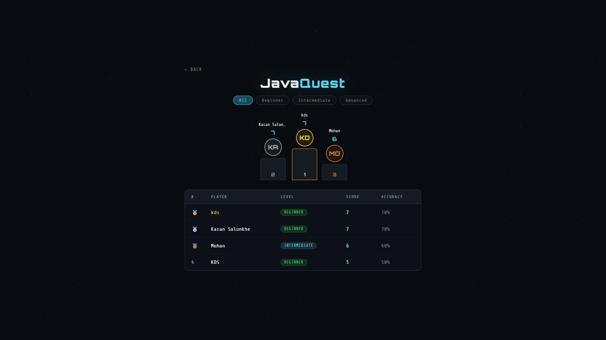

<div align="center">



# ☕ JavaQuest

**Level up your Java. One question at a time.**

[](https://openjdk.org/)
[](https://spring.io/projects/spring-boot)
[](https://www.mysql.com/)
[](https://developer.mozilla.org/en-US/docs/Web/JavaScript)
[](LICENSE)
[](https://github.com/Kds-306/JavaQuest)

A **full-stack Java quiz game** with persistent leaderboard, 150+ interview-ready questions, and a cyberpunk-themed UI — built with Spring Boot REST API and plain HTML/CSS/JS.

[🎮 Play Now](#setup) · [🏆 Leaderboard](#features) · [📖 API Docs](#api-reference) · [⚙️ Setup Guide](#setup)

</div>

---

## 📸 Screenshots

| 🏠 Intro Screen | 🎮 Game Screen | 🏆 Leaderboard |
|:---:|:---:|:---:|
|  |  |  |

---

## ✨ Features

- 🎮 **3 Difficulty Levels** — Beginner, Intermediate, Advanced
- 📚 **150 Questions** — 50 per level, interview-focused Java questions
- 🔟 **10 Questions Per Game** — Randomly shuffled every session
- ⏱️ **20-Second Timer** — With urgency animation for last 7 seconds
- 🏆 **Persistent Leaderboard** — MySQL-backed with podium top-3 display
- 🎯 **Accuracy Tracking** — Score + accuracy % per game
- ⌨️ **Keyboard Navigation** — Press 1-4 or A-D to answer, Enter for next
- 🎨 **Cyberpunk UI** — Animated dot-grid background, neon glow effects
- 🔀 **Dual Database Profiles** — H2 for dev, MySQL for prod (Spring Profiles)

---

## 🛠️ Tech Stack

### Backend
| Technology | Purpose |
|---|---|
| Java 17 | Core language |
| Spring Boot 3.2.2 | REST API framework |
| Spring Data JPA | Database ORM |
| Hibernate | JPA implementation |
| MySQL 8.0 | Production database |
| H2 (in-memory) | Development database |
| Maven | Build tool |

### Frontend
| Technology | Purpose |
|---|---|
| HTML5 | Structure |
| CSS3 | Styling + animations |
| Vanilla JavaScript (ES6+) | Game logic + API calls |
| Google Fonts | Typography (Orbitron, Syne, Share Tech Mono) |

---

## 📁 Project Structure

```
JavaQuest/
│
├── 📁 JavaQuest/                    # Frontend
│   └── 📁 frontend/
│       ├── 📁 css/
│       │   └── style.css            # Cyberpunk theme styles
│       ├── 📁 js/
│       │   ├── game.js              # Game logic, 150 questions
│       │   └── leaderboard.js       # Leaderboard fetch & render
│       ├── index.html               # Main game screen
│       ├── leaderboard.html         # Leaderboard page
│       └── favicon.png              # Custom JQ icon
│
├── 📁 java-quiz-backend/            # Backend (Spring Boot)
│   └── 📁 src/main/
│       ├── 📁 java/com/quiz/
│       │   ├── JavaQuizBackendApplication.java
│       │   ├── 📁 controller/
│       │   │   └── ScoreController.java
│       │   ├── 📁 entity/
│       │   │   └── Score.java
│       │   └── 📁 repository/
│       │       └── ScoreRepository.java
│       └── 📁 resources/
│           ├── application.properties         # Active profile config
│           └── application-dev.properties     # H2 dev config
│
└── 📁 screenshots/                  # README screenshots
    ├── intro.png
    ├── game.png
    └── leaderboard.png
```

---

## 🌐 API Reference

Base URL: `http://localhost:8081`

### Save Score
```http
POST /api/score
Content-Type: application/json

{
  "playerName": "KDS",
  "level": "beginner",
  "score": 8
}
```
**Response:**
```json
{
  "id": 1,
  "playerName": "KDS",
  "level": "beginner",
  "score": 8
}
```

### Get All Scores
```http
GET /api/score/scores
```
**Response:**
```json
[
  {
    "id": 1,
    "playerName": "KDS",
    "level": "beginner",
    "score": 8
  }
]
```

---

## 📊 Question Bank

| Level | Topics Covered | Questions |
|---|---|---|
| 🟢 Beginner | Primitives, loops, arrays, OOP basics, keywords, exceptions | 50 |
| 🟡 Intermediate | Collections, generics, OOP deep dive, Streams, multithreading intro | 50 |
| 🔴 Advanced | Java 8+, Concurrency, JVM internals, Spring Boot, JPA, REST | 50 |
| | **Total** | **150** |

---

## ⚙️ Setup

### Prerequisites
- Java 17+
- Maven
- MySQL 8.0
- Any modern browser

### 1. Clone the Repository
```bash
git clone https://github.com/Kds-306/JavaQuest.git
cd JavaQuest
```

### 2. MySQL Database Setup
```sql
CREATE DATABASE javaquestdb;
```

### 3. Configure Production Properties

Create `java-quiz-backend/src/main/resources/application-prod.properties`:
```properties
spring.datasource.url=jdbc:mysql://localhost:3306/javaquestdb?useSSL=false&serverTimezone=UTC
spring.datasource.username=root
spring.datasource.password=YOUR_PASSWORD
spring.datasource.driver-class-name=com.mysql.cj.jdbc.Driver
spring.jpa.hibernate.ddl-auto=update
spring.jpa.show-sql=true
spring.h2.console.enabled=false
```

### 4. Switch to Production Profile

In `application.properties`:
```properties
spring.profiles.active=prod
```

### 5. Run the Backend
```bash
cd java-quiz-backend
mvn spring-boot:run
```
Backend runs at → `http://localhost:8081` ✅

### 6. Open the Frontend

Open `JavaQuest/frontend/index.html` in your browser directly.

> 💡 **Dev Mode:** Change `spring.profiles.active=dev` to use H2 in-memory database (no MySQL needed).

---

## 🗄️ Database Schema

```sql
CREATE TABLE score (
  id          BIGINT AUTO_INCREMENT PRIMARY KEY,
  player_name VARCHAR(255),
  level       VARCHAR(50),
  score       INT
);
```

> Table is auto-created by Hibernate on first run (`ddl-auto=update`).

---

## 🎮 How to Play

1. Enter your **Player ID**
2. Select a **difficulty level** (Beginner / Intermediate / Advanced)
3. Click **INITIALISE GAME**
4. Answer **10 random questions** within 20 seconds each
5. Use **keyboard shortcuts**: `1-4` or `A-D` to select, `Enter` for next
6. View your **score + accuracy** on result screen
7. Check the **🏆 Leaderboard** to see top players!

---

## 🔧 Spring Profiles

| Profile | Database | Use Case |
|---|---|---|
| `dev` | H2 in-memory | Local development (no MySQL needed) |
| `prod` | MySQL | Production / persistent data |

Switch profiles in `application.properties`:
```properties
spring.profiles.active=dev   # or prod
```

---

## 🚀 Deployment

| Layer | Platform | Status |
|---|---|---|
| Backend | Render | Coming soon |
| Frontend | GitHub Pages | Coming soon |

---

## 👨‍💻 Author

**Karan Dilip Salunkhe**

[](https://github.com/Kds-306)
[](https://linkedin.com/in/karan-salunkhe)

*Java Full Stack Developer | BCA + MCA | Pune*

---

## 📄 License

This project is licensed under the [MIT License](LICENSE).

---

<div align="center">

**⭐ Star this repo if you found it helpful!**

*Built with ☕ Java and lots of passion*

</div>
